# Hi, I'm Jack Shi 👋

I'm a data science and finance student building practical analytics, machine learning, and financial research projects.

  
  
  

## Contact Me

  
  

---

## About Me

I'm currently pursuing an M.S. in Applied Data Science at the University of Chicago, with a background in Economics and Mathematics. My work sits at the intersection of **data analytics, machine learning, finance, and business decision-making**.

I enjoy turning messy data into clear insight, building models for real-world problems, and communicating results in a way that helps people make better decisions.

---

## Tech Stack

<table>
  <tr>
    <td align="center" width="33%">
      <h3>Languages</h3>
      

        
      

      

        
        
      

      
Python · R · JavaScript · TypeScript · HTML/CSS · SQL

    </td>
    <td align="center" width="33%">
      <h3>AI / Machine Learning</h3>
      

        
      

      

        
        
        
        
      

      
Regression · Classification · Clustering · Time Series · NLP · Computer Vision

    </td>
    <td align="center" width="33%">
      <h3>Data Science</h3>
      

        
        
        
        
        
      

      
Data cleaning · Visualization · Statistical modeling · Analytics storytelling

    </td>
  </tr>
  <tr>
    <td align="center" width="33%">
      <h3>Finance & Research</h3>
      

        
        
        
        
      

      
DCF · Comparables · Sector research · Risk analysis · Excel modeling

    </td>
    <td align="center" width="33%">
      <h3>Cloud / Infrastructure</h3>
      

        
      

      
Google Cloud · Git · GitHub · Reproducible workflows

    </td>
    <td align="center" width="33%">
      <h3>Databases & Tools</h3>
      

        
      

      
PostgreSQL · MySQL · Jupyter Notebook · VS Code · Excel VBA

    </td>
  </tr>
</table>

---

## Stats

  
  

---

## Selected Projects

### Computer Vision Bird Tracking
Improved bird detection and track recovery in 4K video data for an avian monitoring project.

### Multimodal Meme Clustering
Built an unsupervised clustering pipeline that combines image embeddings, OCR text, template features, and graph-based clustering.

### Spotify Clustering and Recommendation
Clustered songs with audio features and lyrics text to explore recommendation patterns and listener-facing similarity.

### Financial Valuation and Equity Research
Conducted company valuation, DCF modeling, comparable company analysis, and sector research.

---

## What I'm Working On

- Strengthening my machine learning and data engineering foundations
- Applying computer vision to real-world detection problems
- Preparing for analytics, business analyst, equity research, and quantitative finance roles
- Improving cloud-based data workflows and reproducible project pipelines

---
