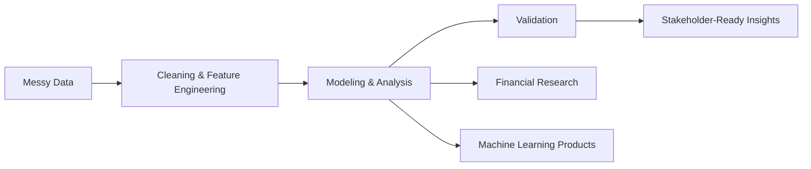

# Hi, I'm Jack Shi 👋

I'm a data science and finance student building practical analytics, machine learning, and financial research projects.

  
  
  

---

## About Me

I'm currently pursuing an M.S. in Applied Data Science at the University of Chicago, with a background in Economics and Mathematics. My work sits at the intersection of **data analytics, machine learning, finance, and business decision-making**.

I enjoy turning messy data into clear insight, building models for real-world problems, and communicating results in a way that helps people make better decisions.

---

## Tech Stack

| Programming | Data Science & ML | Finance & Analytics | Tools |
| --- | --- | --- | --- |
|    |     |     |     |

---

## Project Workflow

---

## GitHub Activity

  

  
  

  

---

## Selected Projects

### Computer Vision Bird Tracking
Improved bird detection and track recovery in 4K video data for an avian monitoring project.

### Multimodal Meme Clustering
Built an unsupervised clustering pipeline that combines image embeddings, OCR text, template features, and graph-based clustering.

### Spotify Clustering and Recommendation
Clustered songs with audio features and lyrics text to explore recommendation patterns and listener-facing similarity.

### Financial Valuation and Equity Research
Conducted company valuation, DCF modeling, comparable company analysis, and sector research.

---

## What I'm Working On

- Strengthening my machine learning and data engineering foundations
- Applying computer vision to real-world detection problems
- Preparing for analytics, business analyst, equity research, and quantitative finance roles
- Improving cloud-based data workflows and reproducible project pipelines

---

## Connect With Me

I'm always open to connecting around data science, finance, research, and analytics projects.

<!-- Add your LinkedIn, email, or portfolio links here when ready. -->
